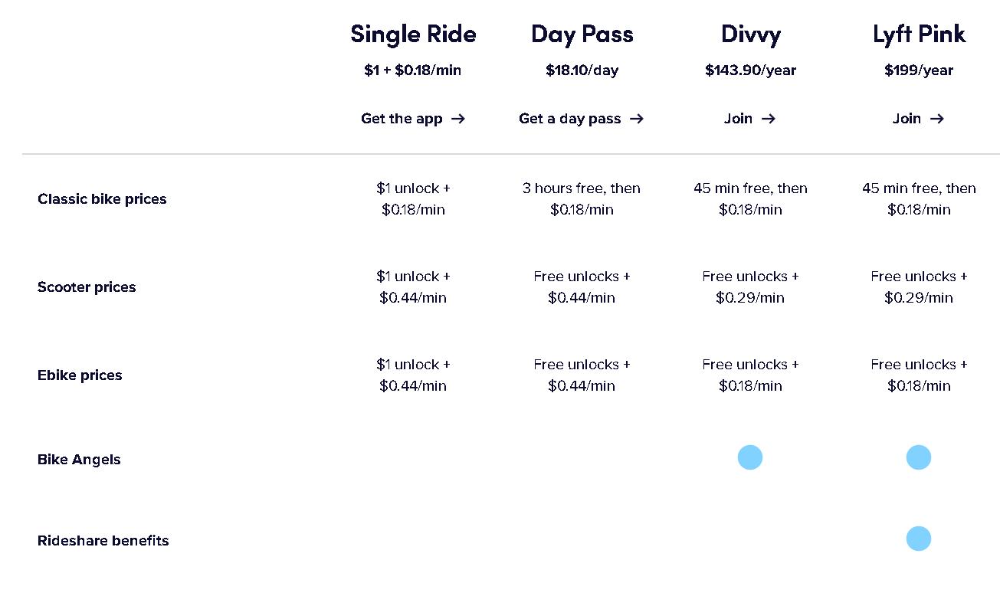
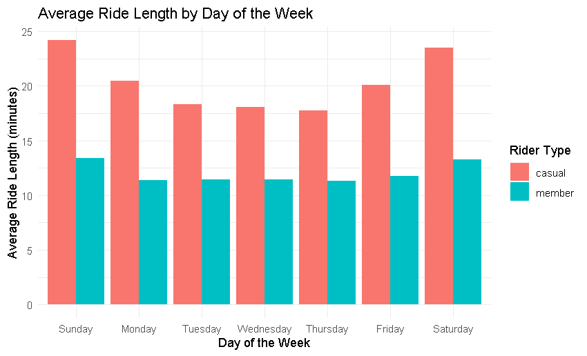
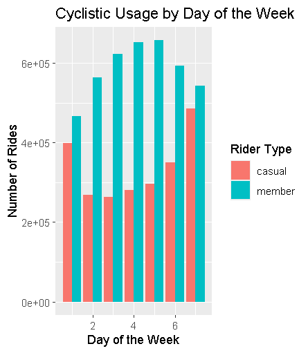
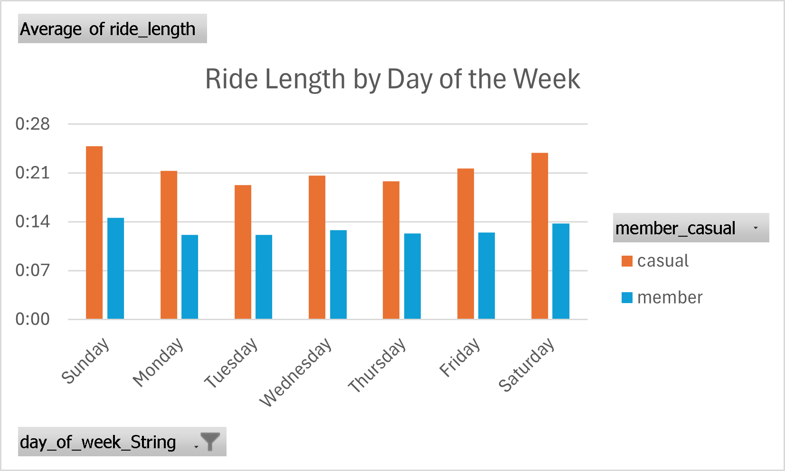
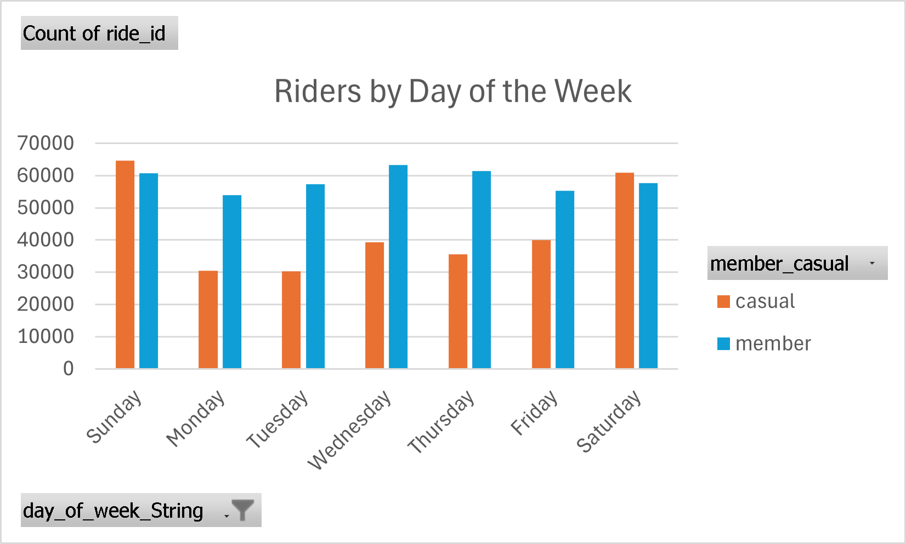

# How can a bike-share company speed up its success?

## Background 
Divvy is a bike-sharing company (partners with Lyft) which services the Chicago area with rental electric and classic bicycles. 

They offer annual and casual memberships. From the insights gained, we will see how we can design a new marketing strategy to convert casual riders into annual members by using data-driven insights.
For reference, prices have been included below. 

## Ask
### How do annual members and casual riders use Divvy differently?
### Key stakeholders 
1. Lily Moreno: Director of marketing 
2. Divvy executive team: The detail-oriented executive team who decides whether or not to approve the marketing program

## Prepare
### Data Sources:
Divvy Bicycle [Data](https://divvy-tripdata.s3.amazonaws.com/index.html) which has been made available by Motivate International Inc. under this [license](https://divvybikes.com/data-license-agreement). This is public dataset does not include PII.

## Process
### Choosing Data Files
The data in this analysis focuses on 13 months which is inside "June2023_to_June2024_DivvyBikeShareData.csv". We also include a single month (June 2024) to track how the most recent month's data is different from the whole
* Note: This file is very large

### Applications
Data has been cleaned, merged, and analyzed using Excel, Python, and R.

### Manual Cleaning
1. Ensured all excel files have the same headers/data types for easy merging (Preview_column_names.py)
2. Formatted cells in the 13 csv files to be the same Date-Time Format

### Transform and Explore
1. Merge data using merge_bicycle_data.py
2. (Now using R, which can be found [here](MergedDivvyData_Analysis.R)) Load packages and data files
3. Remove any rows with Null values, non-standard values in ride_length, and convert ride_length to minutes for computation

We now have 6,453,562 distinct rows for analysis

## Analyze
### Summary statistics and visualizations

(Values in minutes) On average casual members actually ride longer than members despite having to pay larger fees in general

The weekend had longer rides for both member groups, dipping in midweek and picking back up. Casual riders ride longer on average than members on any day of the week, but what about number of rides?

Here we see that despite members taking shorter trips, they account for a larger amount of rides on any day of the week, which could be attributed to members using them for shorter trips whereas members hop on the bicycles less but when they do, they ride for longer.

The data follows the same pattern for a single month (June, 2024).

## Act
* Members tend to use Divvy for regular short commutes/errands reflecting consistent usage patterns and short ride lengths
* Casual Users use Divvy for leisure occasionally but take longer trips and more frequent trips on the weekend.

### Recommendations
1. Introduce incentives like ride credits that encourage frequent usage and/ or longer rides
2. Offer discounts during the weekdays for casual members (tourists, occasional users) to encourage a higher ride count when it's slow.
3. To get casual users to become members and retain members, promote divvy as a cost-effective transit option, a convenient option, and an environmentally sustainable alternative. Use social media, local events, and tourist hotspots to reach the community and tourists.

### Further Questions
* When are the busiest times of the day for each day of the week?
* Why do casual riders usually buy a membership?
* How can Divvy utilize social media to influence casual users to become members?
* Where are the most popular areas according to the geographic data? Can we map members/casual's routes?

